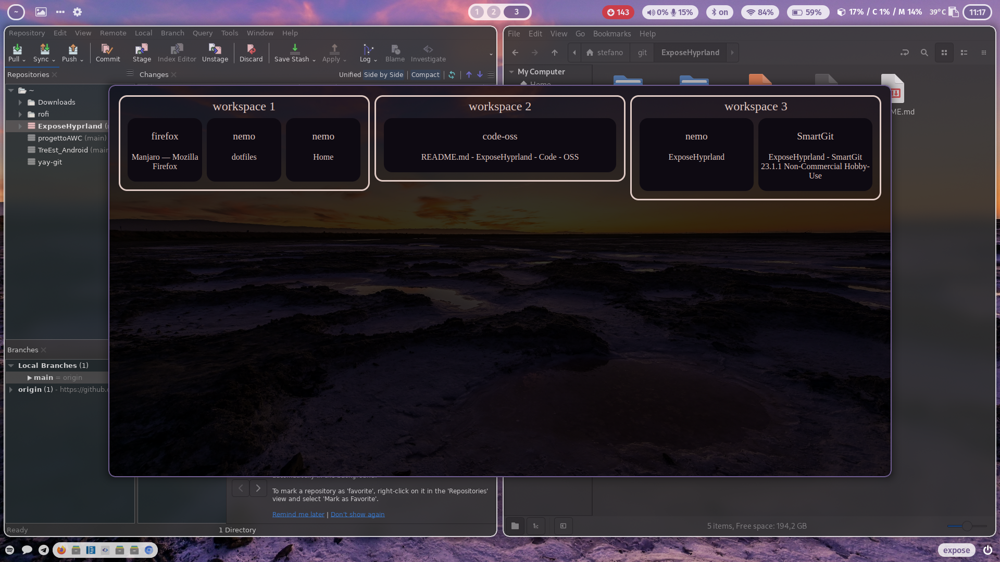

# ExposeHyprland
Expose Hyprland is a simple service to allow a fast checking of the current virtual workspaces and the windows in them, allow also to move between worspaces with a simple click on it thank to the GUI interface.

## Dependancy
- chromium
- node.js
- express

## Usage
- Adjust the launcher script (launcher.sh) to match your installation folder
### permament node.js service
- add the following line to your autostart configuration "exec-once = /path/to/launcher.sh"
- Bind your preferred keyboard key combination to launch Chromium with the custom dashboard. For example, add the following line to your key binding configuration "bind = $mainMod CTRL, E, exec, chromium --app=http://localhost:3100/"
### not permament node.js service
- uncomment the following lines in the index.js file:

    const puppeteer = require('puppeteer');

    const browser = await puppeteer.launch({
        headless: false,
        args: [`--app=http://localhost:3100`],
        ignoreDefaultArgs: ['--enable-automation']
    });
    // Quit Node.js when the browser window is closed
    browser.on('disconnected', () => {
        process.exit();
    });

- Bind your preferred keyboard key combination to launch Chromium with the custom dashboard. For example, add the following line to your key binding configuration "bind = $mainMod CTRL, E, exec, /path/to/launcher.sh"

## Customization
- Setting Up Color Scheme
If you use wal to generate color schemes dynamically, you can link the color file using the following command: "ln -s /path/to/wal/colors.css public/color.css" Alternatively, you can manually specify your color scheme by editing the "public/color.css" file.

- Background Configuration
Link your current background using the following command "ln -s /path/to/your/background.jpg public/background.jpg"

- non permanent node.js service
Link your current background using the following command "ln -s /path/to/your/background.jpg public/background.jpg"